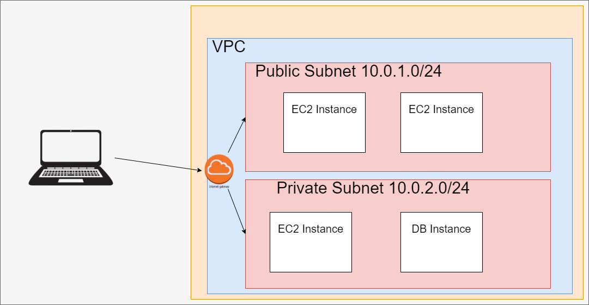
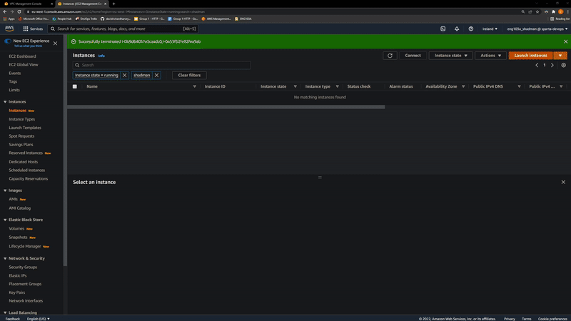
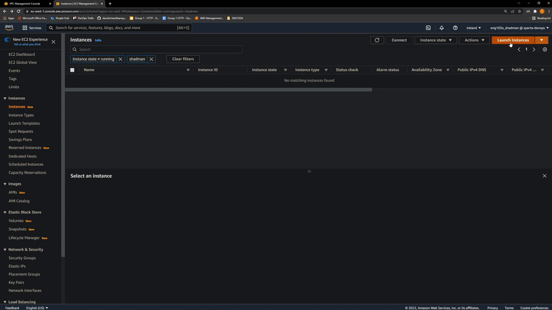
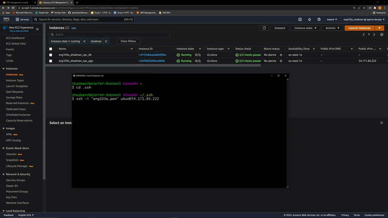
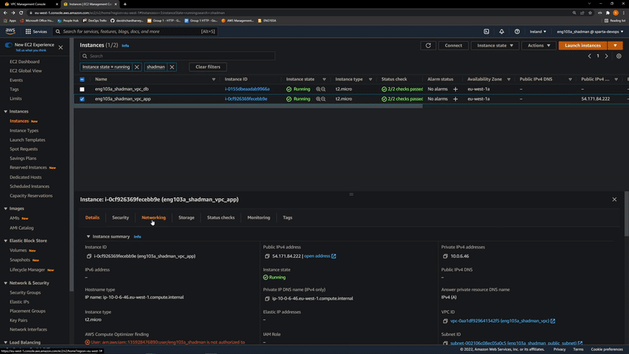

# VPC (Virtual Private Cloud)

## What is a VPC?
It is a amazon's service that lets you create a logically Isolated network in a Region, to launch your amazon resources in.

## What are Subnets?
They are logical subdivision by availability zone of a larger VPC network, in here you can launch your instances, a use case scenario would be to have a public subnet for resources that would be connected to the internet, and having a private subnet for resources that wouldn't be connected to the internet. in each subnet the IP addresses would start with the same prefix.

## What is a route table? 
route table are a set of rules called route to determine where the traffic for the VPC is directed. It is possible to associate a subnet with particular route tables depending of the user's use case scenario.

## What is an internet gateway?
a CIDR block is an gateway that you attach to your VPC to enable communication between resources in your VPC and the internet.

## What is a CIDR block?
A CIDR block (Classless Inter-Domain Routing) is an internet protocol address allocation and route aggregation methodology.

## What is NACL?
Network ACLs: An optional layer of security for your VPC that acts as a firewall for controlling traffic in and out of your subnets.

- Create VPC. (IPv4 CIDR 10.0.0.0/16)
- Create an Internet Gateway, and attach it to our VPC.
- Create a Public and Private subnets. (example 10.0.1.0/24, 10.0.2.0/24)
- Create a route tables for each subnets, associate them to their respective subnets.
- For the public Route Table, allow Internet Gateway access from anywhere.

### Setup The 2-Tier infrastructure using the two subnets
#### For App instance:
- Create The App VM using the Our App AMI.
- Select our Created VPC and the public subnet, also enable assignment of a Public IP.
- Create a security group, where everyone is allowed HTTP port, and My-IP is allowed SSH port.

#### For DB instance:
- Create The DB VM using the Our DB AMI.
- Select our Created VPC and the private subnet, also disable assignment of a Public IP.
- Create a security group, where only the private subnet is allowed to access port 27017.

SSH into the app instance, and attach the DB using it's private IP.

Now your if you go to your App IP, you should see the app, and if you go to /posts, you should be able to see the Recent posts, meaning that the DB is connected properly.

